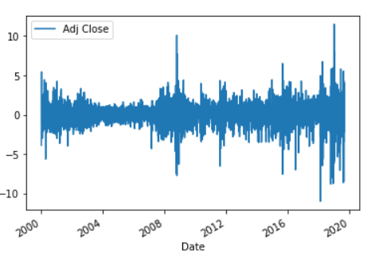
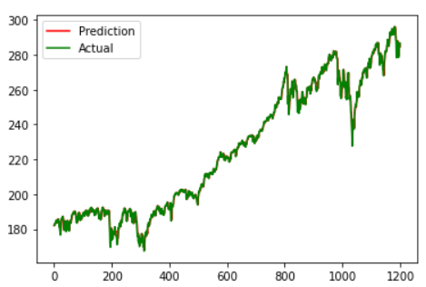
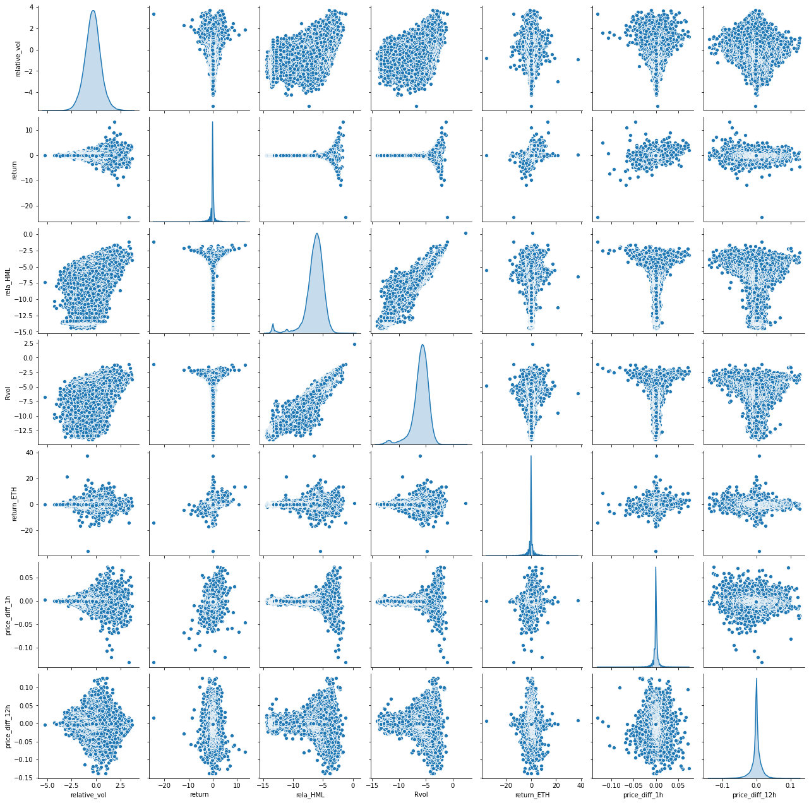
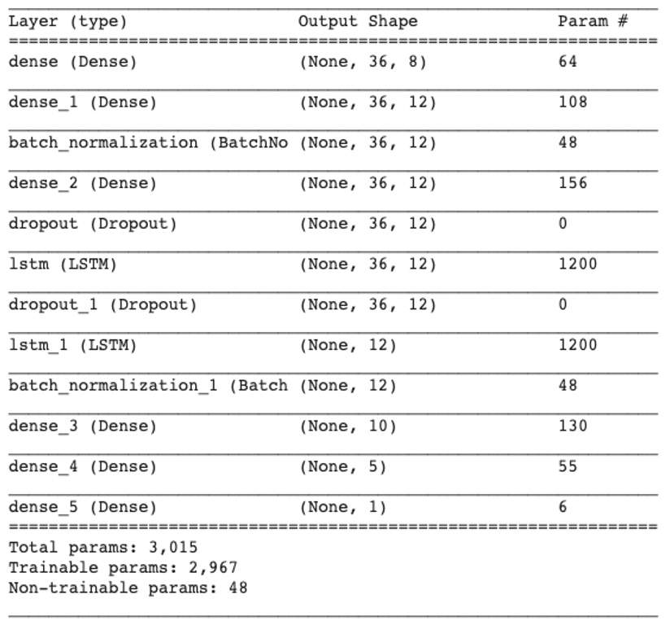
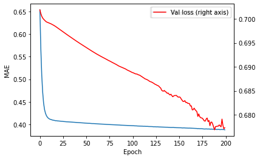
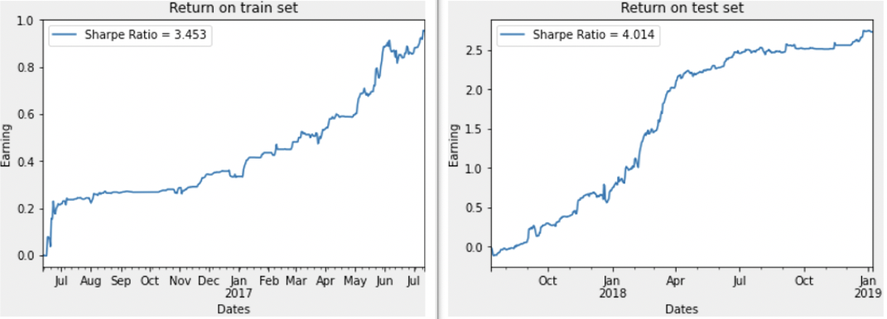
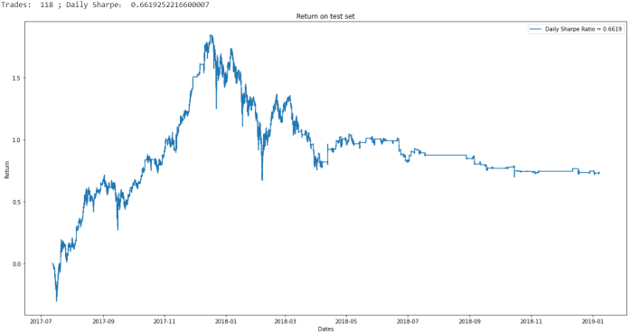
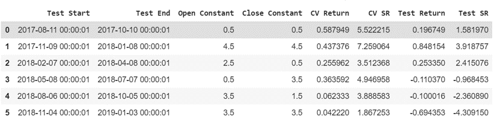

Forecasting time series data is an important subject in economics, business, and finance. The paper *Forecasting Economic and Financial Time Series: ARIMA vs. LSTM* advocates the benefits of applying deep learning-based algorithms to the economics and financial data. Our work in this report is evaluating the merits of the paper’s comparative approach to predicting financial time series using LSTM vs. ARIMA models by applying both models on common financial time series. We will also evaluate alternative deep-learning models on more fine-grained Bitcoin data. Experimental results show that following the procedure of the paper does not generate the result that supports the superiority of the LSTM model over ARIMA model; and our trading strategy on Bitcoin using LSTM model generates slight better return than Bitcoin return over the same period, but the trading strategy is highly dependent on the chosen level of trading aggressiveness and on our chosen hyperparameters.

**Keywords**: Bitcoin; trading strategy; crypotocurrency; neural networks; Forecasting; Economic and Financial Time Series; Deep Learning; Long Short-Term Memory (LSTM); Autoregressive Integrated Moving Average (ARIMA); Root Mean Squared Error (RMSE)

Introduction
============

There are many research papers nowadays investigating which forecasting methods offer best predictions with respect to lower forecast errors and higher accuracy of forecasts. Traditional time series prediction methods include univariate Autoregressive (AR), univariate Moving Average (MA), Simple Exponential Smoothing (SES), and Autoregressive Integrated Moving Average (ARIMA). Due to lack of seasonality in the stock markets and its high volatility, these traditional linear statistical model are not very effective for this task. Machine learning methods seem to be promising in this regard, since they can incorporate non-linearity in prediction models to deal with non-stationary financial time-series.

Particularly, Siami-Namini’s paper has successfully applied Machine Learning techniques called LSTM model for stock markets prediction: it achieves 84-87 percent average reduction in error rate when compared to ARIMA, indicating the superiority of LSTM to ARIMA. Without doubt, expecting improvement is reasonable as RNN and LSTM neural networks is likely to predict prices better than the traditional multi-layer perceptron (MLP) and linear algorithm like ARIMA due to the temporal nature of the more advanced algorithms. However, although the result from this paper seems promising, there is a dearth of research critique and replication to validate such result. Therefore, the main objective of this article is to test and verify the empirical result of their findings.

In our paper, we focus on two aspects to verify the validity of the paper. First, although the paper shows significant improvement in predictive power using the deep learning model, the authors of the paper do not make relevant data publicly available for the readers to replicate its result. As the movement to examine and enhance the reliability of research expands, the lack of methodology and analysis plan in the paper make us feel that such a result might suffer from p-hacking, since the authors would have the freedom to make choices such as which observations to measure, which variables to compare, which factors to combine, and which ones to control for. As a result, such a freedom would allow the authors to manipulate their study conditions until they get the answer that they want. Therefore, in order to verify the conclusion of the paper, we consider a set of different data to train the models and compare their predictive performance with each other. Secondly, the growth of virtual currencies has fueled interest from the scientific community. As cryptocurrencies have faced period rise and sudden dips in specific time periods, cryptocurrency trading community has a need for a standardized method to accurately predict the fluctuating price trends. Therefore, for application purposes in algorithmic trading, we use high-frequency Bitcoin data to implement our proposed architecture to test two two simple trading strategies, and then evaluate the merit of paper’s claim from a trading strategy perspective.

We will split this paper into two parts:

1.  Evaluation of paper’s methodology and results

2.  Implementation of alternative specifications for Bitcoin (BTC) data.

Evaluation of Paper’s Methodology
=================================

Data analysis
-------------

### Selection of Dataset

As mentioned above, the dataset used by the paper, though stated, is not clearly described. In particular, they used only 200 data points without stating what time period these were selected from or why. Therefore, we test the model on predicting the price of other common financial products. We chose the State Street S&P 500 Index ETF (NYSE: SPY) as the time series to be predicted. We chose this series as it is a good proxy for the overall market and exhibits minimal tracking error with the S&P 500 Index. It is also heavily traded and thus trades very close to its NAV.

### Data Features

The dataset contains adjusted closing prices of SPY from January 2000 to August 2019, which encompasses about 4940 data points. We split this into 3740 training samples and 1200 test samples.

Similar to the paper, we found the data to be non-stationary. First-differencing the data yielded a stationary time-series, hence justifying the paper’s use of 1 integration term in the ARIMA specification. This is also in line with the prevailing theory about stock market returns. There does appear to be some amount of heteroskedasticity in the returns, however we ignore this for now.

Architecture
------------

The paper used an ARIMA(5,1,0) as a baseline model for comparison. It is not explained in the paper why 5 lags are used, not are confidence intervals clearly stated.

As an improvement over this model, the paper proposes an LSTM model with 1 Dense Layer and an Adam Optimizer using a Mean Square Error loss. The architecture of the model is summarized by the following code:

    model = Sequential()
    model.add(LSTM(neurons, batch_input_shape=(batch_size, X.shape[1], X.shape[2]), stateful=True))
    model.add(Dense(1))
    optimizer = optimizers.Adam(clipvalue=0.5)
    model.compile(loss='mean_squared_error', optimizer=optimizer)

A clipvalue parameter was added by us to avoid a vanishing gradient problem during the training.

Training
--------

The training process uses 10 epochs. It is quite fast and is completed in 5-10 seconds at most.

After running the training process we observed a few concerning problems. Firstly, the training loss plateaued after the first epoch, indicating that the deep-learning model isn’t actually learning much from the training data. Secondly, the paper appears to be aware of this issue; however, it makes no comment about it.

Tests: Daily SPY Price and Returns
----------------------------------

Next, we use the LSTM model to perform rolling forecasts. This is done by looking at today’s actual SPY level to predict tomorrow’s level. A similar strategy is used for the ARIMA(5,1,0) model.

Firstly, to evaluate the paper’s claim of an improvement in RMSE for the level prediction we predicted over the entire test horizon.

0.5  [fig:subim1]

0.5  [fig:subim2]

[fig:image2]

As is evident from the graphs, the two models are pretty much identical in their performance. Quantitatively, LSTM produced an RMSE of 1.932 vs 1.937 for ARIMA. We do not believe this is a significant or meaningful improvement. This calls into question the paper’s claims of an 85% improvement in the RMSE.

Next, to predict the returns we compute the percentage change between the observed price today and the predicted price tomorrow.

0.5  [fig:subim1]

0.5  [fig:subim2]

[fig:image2]

Clearly the return is indicative that there is very little to no predictability in the returns.

Final Rebuttal: The Naive Model
-------------------------------

As a final rebuttal, we constructed what we call the Naive Model. This model simply predicts tomorrow’s SPY level to be the same as today. For example if the level was \$300 today, it will be predicted as \$300 tomorrow. A consequence of this is that the return prediction is always 0 (martingale property).

We evaluated the RMSE Naive Model and found it to be 1.934. We believe this is a final blow to the paper’s claims of superiority of the LSTM model as we can see it performs no better than a very simplistic model.

In hindsight this is not surprising. Predicting returns is very difficult and it would be indeed surprising if they could be predicted with any degree of accuracy using lagged returns as the only explanatory variable.

LSTM on Intraday Predictions
============================

Feature Engineering
-------------------

Data for the present study has been collected from several sources. We have selected features that may be driving Bitcoin prices and have performed feature engineering to obtain independent variables for future price prediction. Bitcoin prices are driven by a combination of various endogenous and exogenous factors (Elie Bouri, 2017). The inherent technical aspects of Bitcoin are considered to be endogenous factors. 1-min Bitcoin times series data in USD is obtained from Coinbase, while 1-min Etherem dataset is obtained from Kaggle. After cleaning and manipulating the datasets and doing feature engineering, the key endogenous features considered in the present study are Bitcoin 10-min return, relative 10-min Bitcoin trading volume, 10-min high-minus-low price over mean close price (price range), log realized volatility, MACD (10-min average price cross 2-hour average price), MACD (2h; 12h). The exogenous features consist of second largest cryptocurrency, Ethereum, which may impact the prices. The exogenous factor of interest in this study is standardized Ethereum return. Ethereum price is used is to investigate the characteristics of Bitcoin investors and price relationship between the two largest cryptocurrencies. Some technical analysis variables are constructed to explore how these technical analysis indicators can predict future Bitcoin prices.

 [fig:fig1]

Correlation between features are shown in Figure [fig:feature corr]. Features seem to be uncorrelated except for High minus Low (rela\_HML) and realized volatility (Rvol). This can be expected since both of the features describes an aspect of the price volatility.

 [fig:feature corr]

Baseline
--------

### Baseline Selection

A baseline is the result of a very basic model. The baseline we use here is Null Predictor, which predicts all returns as 0.

Based on the Efficient Market Hypothesis (EMH), share prices reflect all information and consistent alpha generation is impossible. Therefore, it should be impossible to outperform the overall market through expert stock selection or market timing. Although the baseline model seems trivial, it is very reasonable, and complex models can’t necessarily beat such baseline model. Of course, if our deep learning model outperforms the Null Predictor baseline, then our strategy model is successful and meets expectation.

### Mathematical Explanation

-   MAE – Mean Absolute Error

    This measures the absolute average distance between the real data and the predicted data \[{\rm MAE}=\frac{1}{n}\sum |y-\hat{y}|\]

-   MSE - Mean Squared Error

    This measures the squared average distance between the real data and the predicted data. \[{\rm MSE}=\frac{1}{n}\sum(y-\hat{y})^2=\frac{1}{n}\sum(y^2+\hat{y}^2-2y\hat{y})\]

We can see that \(y^2\) and \(\hat{y}^2\) are both penalized terms and non-negative. The term \(y\hat{y}\) should be analyzed accordingly - if it is positive, then MSE value decreases, which shows the expected effect of prediction.

In our baseline model here, \(\hat{y}=0\), thus \({\rm MSE}=\frac{1}{n}\sum y^2\). the smaller our predicted value \(y\) is, the better \({\rm MSE}\) we can have.

In our first attempt to develop an LSTM on daily SPY return, we found both models even fail to beat the Null Predictor as shown in Table [tab:1].

||Null Predictor|1-layer LSTM|2-layer LSTM|
|:-:|:------------:|:----------:|:----------:|
|MAE(%)|0.5886|0.5886|0.5996|
|MSE(%)|0.7384|0.7392|0.7693|
|||Underfitting|Overfitting|

[tab:1]

It turns out that making prediction is even worse than making no prediction. One thing we learned from the results is that it is difficult to outperform the “simple” baseline model, which also aligns with the efficient market hypothesis. As daily returns are hardly predictable, we build an LSTM model to predict hourly-return on 1-min BTC price data in the following pages. We stick with the Null Predictor baseline to see if our trained model is can beat it.

Architecture
------------

The model architecture mainly refers to the similar architecture described in Bao W, Yue J, Rao Y, which employed 3 dense layers as “feature engineering” layers to transform the low-level features into high-level features, 2 LSTM layers and 3 dense layers in turns. Dropouts and BatchNorm layers are also included to enhance model robustness as shown in Figure [fig:architecture].

 [fig:architecture]

Training Model
--------------

We employed Nadam optimizer with learning rate set to 0.001 and batchsize set to 10,000 for stability.

We first train the model using data from 2016-05-12 to 2017-07-12 (49,767 samples). And then making predictions and retrain the model in a rolling horizon. Training the first model took 200 epochs. Training curve is shown in Figure [fig:learningcurve]. After 200 the validation loss goes up in our experiments.

 [fig:learningcurve]

The rolling training and prediction windows are described in Table [tab:rolling]. Since model weights are updated based on previous weights, a few epochs would often be enough. Therefore we used EearlyStopping callback function during the retraining. The fitting function will automatically choose the weights that minimized validation-loss during the retraining process.

[htp]

|Training Window|Prediction Window|
|:-------------:|:---------------:|
|2016-05-12 00:00—2017-07-12 00:00|2017-07-12 00:00—2017-10-09 23:50|
|2016-08-10 00:00—2017-10-10 00:00|2017-10-10 00:00—2018-01-07 23:50|
|2016-11-08 00:00—2018-01-08 00:00|2018-01-08 00:00—2018-04-07 23:50|
|2017-02-06 00:00—2018-04-08 00:00|2018-04-08 00:00—2018-07-06 23:50|
|2017-05-07 00:00—2018-07-07 00:00|2018-07-07 00:00—2018-10-04 23:50|
|2017-08-05 00:00—2018-10-05 00:00|2018-10-05 00:00—2019-01-07 21:50|

[tab:rolling]

Model Evaluation
----------------

[htp]

||Null Predictor|LSTM|Improvement|
|:-:|:------------:|:--:|:---------:|
|MAE(%)|0.64124|0.61579|4.0% less|
|MSE(%)|1.18428|1.08169|8.7% less|

[tab:evaluate]

As it shows in Table [tab:evaluate], our model realized a 8.7% reduction in MSE and 4.0% reduction in MAE compared to our baseline model. We also evaluate the information coefficient (IC) of our prediction which yields 0.089. This evaluation result is tested on over 70,000 samples, therefore this performance is very significant across time.

We also test the correlation between our prediction and future return on a naive strategy which simply assumes we buy BTC when predicted return \> 0.05% and sell when predicted return \< -0.05%. Neglecting all kinds of cost, the strategy realized a Sharpe Ratio of 3.45 on training set and 4.01 on test set. Receiving better results on test set than on training set is surprising, but it does show that the model seems not highly exposed to overfitting and its predictions has significant forecastability on future returns.

Note that after including the transaction costs this is yet a profitable strategy in practice, therefore we explore to build a strategy in following context.

 [fig:return]

Trading Strategy
----------------

### Introduction

With a promising model in place, we now focus on implementing a trading strategy to exploit the model’s predictions. There are several practical considerations to be made when implementing a trading strategy than can simulate a real world trading environment. These are as follows:

1.  Trade signal has a lot of jitter. In a practical environment, we would not want to trade excessively on every period’s signal.

2.  Because there are always trading costs involved, we may want to restrict our trading to signals that are stronger than a chosen threshold.

3.  Finally, we may want some asymmetry in our trading strategy i.e. we may want to liquidate open positions much more aggressively (in response to trade signals) than opening new positions (or vice versa).

4.  We need a model of trading costs for penalizing excessive trading

To mitigate these issues, we implement the following solutions:

1.  We use Exponential Moving Average of return signals to determine trade signals. The length of the averaging period will be a hyperparameter.

2.  We only trade if the return signal is larger than some fraction of last day’s volatility. The fraction to be used will be a hyperparameter.

3.  We use different signal thresholds for entering and exiting positions.

4.  We use a proportional trading cost of 0.15% per trade.

### Initial Results

For an initial run of the trading model, we made an arbitrary choice of hyperparameters. We open a long (short) a position if the predicted return is greater (lesser) than 1 times the 1 day volatility. We close a long (short) position if the return is lesser (greater) than 0.1 times the 1 day volatility.

After running this strategy on the test set, we observe that the model traded 118 times and produced a Sharpe Ratio of 0.662 for a return of 73%.

 [fig:fig1]

This looks very good as BTC only returned 50% over the same period. However, there is a catch. The return is highly hyperparameter dependent and our hyperparameters were chosen arbitrarily.

### Hyperparameter Tuning

After running a cross-validation approach, we found that the trading strategy is highly dependent on the chosen levels of trading aggressiveness (the open/close constants). Moreover the hyperparameters are highly unstable over time and sometimes lead to highly negative returns.

 [fig:fig1]

In addition to the explicit hyper parameters, there are several implicit ones that we did not tune. For example:

1.  Length of Recalibration interval (30 days in above results).

2.  Length of Retraining interval (90 days right now).

3.  Finer grid of open/close constants.

### Limitations

Our model is inherently very short term. It is only meant to predict returns over very short horizons. Thus it is not surprising that while it performs well on short term metrics its performance deteriorates over time.

Moreover, the trading costs exact a heavy toll on our model. Every trade costs us 0.15% and thus the 118 trades in our previous results cost as much as 18% of the return.

### Refinements

There are several refinements possible to consider:

1.  Take into account bid ask spreads when computing returns.

2.  Execution delay – In practice we may not be able to trade instantly on receiving signal.

3.  Determine correct static rebalancing interval and hyperparameters – Need more computational power.

4.  Better still – Model should recognize persistent underperformance on its own and signal the trading platform as such – Dynamic retraining intervals.

Conclusion and Future Work
==========================

With the recent advancement on developing sophisticated machine learning-based techniques and deep learning algorithms, many research papers have claimed that their empirical findings have shown the superior performance of machine learning and deep learning models over the traditional time-series model in predicting the prices of various financial assets. The major question is then how convincing and reliable these papers’ result are. This paper focus on one such empirical finding by applying different financial data set to compare the predicting accuracy of ARIMA and LSTM and then constructing high-frequency trading strategy of Bitcoin to test profitability of LSTM model. These two predicting techniques were implemented and applied on State Street S&P 500 Index ETF (NYSE: SPY) and the result indicated that RMSEs of these two techniques are essentially the same. More specifically, the LSTM-based and ARIMA algorithms have values of 1.932 and 1.937 respectively. Furthermore, taking into account of the transaction cost, trading strategy based on the LSTM algorithms do not generate significant risk-adjusted return. The work described in this paper casts doubt on the benefits of applying deep learning-based algorithms and techniques to the economics and financial data.

However, there are further work to refine our deep learning models and potentially improve their predicting power. For instance, deep learning models require accurate training and hyperparameter tuning to yield results. Although training might be computationally extensive for large datasets unlike conventional time-series approaches, the market data is always limited and computational complexity is not really a big concern for stock or cryptocurrency price prediction, and thus shallow learning quantitative finance in the coming years. Therefore, with proper back testing of these deep learning model are likely contribute significantly to manage portfolio risk and reduce financial losses. Nonetheless a significantly improvement over the current study is likely achieved if a bigger data set is available.

Recommendations for production
==============================

1

Sima Siami Namini, Akbar Siami Namin. Forecasting Economics and Financial Time Series: ARIMA vs. LSTM. In *arXiv:1803.06386*, 2018.

Bao W, Yue J, Rao Y. A deep learning framework for financial time series using stacked autoencoders and long-short term memory. In *PLoS ONE 12(7): e0180944*, 2017.

Aniruddha Dutta, Saket Kumar and Meheli Basu. A Gated Recurrent Unit Approach to Bitcoin Price Prediction. , 2019.

Bouri, E, Molnár, P, Azzi, G, Roubaud, D. On the hedge and safe haven properties of Bitcoin: Is it really more than a diversifier? , 2017.
